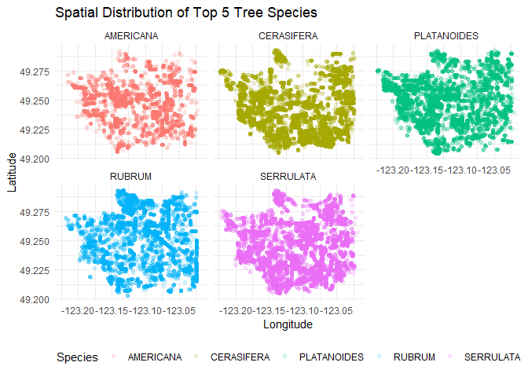

Mini Data Analysis2
================
Xiaoxi Gao 20347548

*To complete this milestone, you can edit [this `.rmd`
file](https://github.com/UBC-STAT/STAT545.github.io/blob/main/content/mini-data-analysis/mini-project-2.Rmd)
directly. Fill in the sections that are commented out with
`<!--- start your work here--->`. When you are done, make sure to knit
to an `.md` file by changing the output in the YAML header to
`github_document`, before submitting a tagged release on canvas.*

# Welcome to the rest of your mini data analysis project!

In Milestone 1, you explored your data. and came up with research
questions. This time, we will finish up our mini data analysis and
obtain results for your data by:

- Making summary tables and graphs
- Manipulating special data types in R: factors and/or dates and times.
- Fitting a model object to your data, and extract a result.
- Reading and writing data as separate files.

We will also explore more in depth the concept of *tidy data.*

**NOTE**: The main purpose of the mini data analysis is to integrate
what you learn in class in an analysis. Although each milestone provides
a framework for you to conduct your analysis, it’s possible that you
might find the instructions too rigid for your data set. If this is the
case, you may deviate from the instructions – just make sure you’re
demonstrating a wide range of tools and techniques taught in this class,
and indicate *why* you had to deviate. Feel free to contact the
instructor in these cases.

# Instructions

**To complete this milestone**, edit [this very `.Rmd`
file](https://github.com/UBC-STAT/STAT545.github.io/blob/main/content/mini-data-analysis/mini-project-2.Rmd)
directly. Fill in the sections that are tagged with
`<!--- start your work here--->`.

**To submit this milestone**, make sure to knit this `.Rmd` file to an
`.md` file by changing the YAML output settings from
`output: html_document` to `output: github_document`. Commit and push
all of your work to your mini-analysis GitHub repository, and tag a
release on GitHub. Then, submit a link to your tagged release on canvas.

**Points**: This milestone is worth 50 points: 45 for your analysis, and
5 for overall reproducibility, cleanliness, and coherence of the Github
submission.

**Research Questions**: In Milestone 1, you chose four research
questions to focus on. Wherever realistic, your work in this milestone
should relate to these research questions whenever we ask for
justification behind your work. In the case that some tasks in this
milestone don’t align well with one of your research questions, feel
free to discuss your results in the context of a different research
question.

# Learning Objectives

By the end of this milestone, you should:

- Understand what *tidy* data is, and how to create it using `tidyr`.
- Generate a reproducible and clear report using R Markdown.
- Manipulating special data types in R: factors and/or dates and times.
- Fitting a model object to your data, and extract a result.
- Reading and writing data as separate files.

# Setup

Begin by loading your data and the tidyverse package below:

``` r
library(datateachr) # <- might contain the data you picked!
library(tidyverse)
library(here)
library(patchwork)
```

# Task 1: Process and summarize your data

From Milestone 1, you should have an idea of the basic structure of your
dataset (e.g. number of rows and columns, class types, etc.). Here, we
will start investigating your data more in-depth using various data
manipulation functions.

### 1.1 (1 point)

First, write out the 4 research questions you defined in milestone 1
were. This will guide your work through milestone 2:

<!-------------------------- Start your work below ---------------------------->

1.  What are the top five most common tree species in Vancouver, and how
    are their numbers distributed across the city?
2.  Do major species show specific geographical preference?
3.  Is tree diameter driven by planting year?
4.  Do Old trees (diameter \> 100 cm) tend to appear more frequently on
    specific streets or locations?
    <!----------------------------------------------------------------------------->

Here, we will investigate your data using various data manipulation and
graphing functions.

### 1.2 (8 points)

Now, for each of your four research questions, choose one task from
options 1-4 (summarizing), and one other task from 4-8 (graphing). You
should have 2 tasks done for each research question (8 total). Make sure
it makes sense to do them! (e.g. don’t use a numerical variables for a
task that needs a categorical variable.). Comment on why each task helps
(or doesn’t!) answer the corresponding research question.

Ensure that the output of each operation is printed!

Also make sure that you’re using dplyr and ggplot2 rather than base R.
Outside of this project, you may find that you prefer using base R
functions for certain tasks, and that’s just fine! But part of this
project is for you to practice the tools we learned in class, which is
dplyr and ggplot2.

**Summarizing:**

1.  Compute the *range*, *mean*, and *two other summary statistics* of
    **one numerical variable** across the groups of **one categorical
    variable** from your data.
2.  Compute the number of observations for at least one of your
    categorical variables. Do not use the function `table()`!
3.  Create a categorical variable with 3 or more groups from an existing
    numerical variable. You can use this new variable in the other
    tasks! *An example: age in years into “child, teen, adult, senior”.*
4.  Compute the proportion and counts in each category of one
    categorical variable across the groups of another categorical
    variable from your data. Do not use the function `table()`!

**Graphing:**

6.  Create a graph of your choosing, make one of the axes logarithmic,
    and format the axes labels so that they are “pretty” or easier to
    read.
7.  Make a graph where it makes sense to customize the alpha
    transparency.
8.  Create a graph that has at least two geom layers.
9.  Create 3 histograms, with each histogram having different sized
    bins. Pick the “best” one and explain why it is the best.

Make sure it’s clear what research question you are doing each operation
for!

<!------------------------- Start your work below ----------------------------->

``` r
#Q1: Most common five species and their count distribution

top_10_species_counts <- vancouver_trees %>%
  count(species_name, sort = TRUE, name = "count") %>% 
  slice_head(n = 10) 

print("Top 10 Species Counts")
```

    ## [1] "Top 10 Species Counts"

``` r
top_10_species_counts
```

    ## # A tibble: 10 × 2
    ##    species_name count
    ##    <chr>        <int>
    ##  1 SERRULATA    13357
    ##  2 CERASIFERA   12031
    ##  3 PLATANOIDES  11963
    ##  4 RUBRUM        8467
    ##  5 AMERICANA     5515
    ##  6 SYLVATICA     5285
    ##  7 BETULUS       5195
    ##  8 EUCHLORA   X  4427
    ##  9 FREEMANI   X  4164
    ## 10 CAMPESTRE     3477

``` r
p_rq1 <- top_10_species_counts %>%
  
  filter(!is.na(species_name)) %>%
  ggplot(aes(x = reorder(species_name, count), y = count)) +
  geom_col(fill = "#1F78B4") + 
  geom_text(aes(label = count), vjust = 0.5, hjust = -0.1, size = 3) + # Geom Layer 2: Text labels
  coord_flip() + 
  labs(
    title = "Top 10 Tree Species Counts in Vancouver",
    x = "Species Name",
    y = "Number of Trees"
  ) +
  theme_minimal()

print(p_rq1)
```

<!-- -->

``` r
if (!dir.exists(here("output"))) {
  dir.create(here("output"))
}
ggsave(
  filename = "Q1_Top10_Species.png",
  plot = p_rq1,
  device = "png",
  path = here("output"),
  width = 8, 
  height = 5
)
```

**Analysis Justification (Q1):**

- **Summarizing:** This summary table helps identify the most frequently
  observed species, which sets up the “top 5” group I use later for
  spatial analysis.

- **Graphing:** The bar chart makes it easy to compare how common each
  top species is. I added text labels on top of the bars so the exact
  counts are clear, not just the visual differences.

``` r
#Q2: Do major species show specific geographical preference?

top5_species_names <- top_10_species_counts %>% slice_head(n = 5) %>% pull(species_name)

species_by_neighbourhood_prop <- vancouver_trees %>%
  filter(species_name %in% top5_species_names) %>%
  group_by(species_name) %>%
  mutate(total_species_count = n()) %>%
  group_by(species_name, neighbourhood_name) %>%
  summarise(
    neighborhood_count = n(),
    total_species_count = first(total_species_count),
    proportion_in_neighborhood = neighborhood_count / total_species_count,
    .groups = "drop"
  ) %>%
  filter(!is.na(neighbourhood_name)) %>%
  arrange(species_name, desc(proportion_in_neighborhood))

print("Species Distribution Proportion by Neighborhood (Top 5)")
```

    ## [1] "Species Distribution Proportion by Neighborhood (Top 5)"

``` r
species_by_neighbourhood_prop %>% slice_head(n = 10)
```

    ## # A tibble: 10 × 5
    ##    species_name neighbourhood_name       neighborhood_count total_species_count
    ##    <chr>        <chr>                                 <int>               <int>
    ##  1 AMERICANA    SHAUGHNESSY                             780                5515
    ##  2 AMERICANA    KENSINGTON-CEDAR COTTAGE                747                5515
    ##  3 AMERICANA    DUNBAR-SOUTHLANDS                       435                5515
    ##  4 AMERICANA    KERRISDALE                              340                5515
    ##  5 AMERICANA    VICTORIA-FRASERVIEW                     293                5515
    ##  6 AMERICANA    KITSILANO                               260                5515
    ##  7 AMERICANA    RILEY PARK                              251                5515
    ##  8 AMERICANA    ARBUTUS-RIDGE                           225                5515
    ##  9 AMERICANA    WEST POINT GREY                         210                5515
    ## 10 AMERICANA    GRANDVIEW-WOODLAND                      208                5515
    ## # ℹ 1 more variable: proportion_in_neighborhood <dbl>

``` r
vancouver_trees_top5 <- vancouver_trees %>%
  filter(species_name %in% top5_species_names)


p_rq2_spatial <- vancouver_trees_top5 %>%
  filter(!is.na(longitude) & !is.na(latitude)) %>%
  ggplot(aes(x = longitude, y = latitude, color = species_name)) +
  geom_point(alpha = 0.15) +
  facet_wrap(~species_name) +
  labs(
    title = "Spatial Distribution of Top 5 Tree Species", 
    x = "Longitude",
    y = "Latitude",
    color = "Species"
  ) +
  theme_minimal() +
  theme(legend.position = "bottom")

print(p_rq2_spatial) 
```

<!-- -->

``` r
ggsave(
  filename = "Q2_Top5_Spatial_Density.png",
  plot = p_rq2_spatial,
  device = "png",
  path = here("output"),
  width = 10,
  height = 5
)
```

**Analysis Justification (Q2):**

- **Summarizing:** This table shows how species are distributed across
  neighborhoods. When a few neighborhoods have really high proportions,
  it supports the idea that the species tends to cluster in certain
  areas.

- **Graphing:** Setting alpha to 0.15 helps a lot when plotting a big
  dataset on a map. It avoids overplotting and makes it easier to spot
  real clusters, which directly ties back to the spatial preference
  question.

``` r
#Q3: Is tree diameter driven by planting year?

vancouver_trees_categorized <- vancouver_trees %>%
  mutate(
    Size_Category = case_when(
      diameter <= 15 ~ "Young/Small",
      diameter > 15 & diameter <= 50 ~ "Medium/Established",
      diameter > 50 & diameter <= 100 ~ "Large/Mature",
      diameter > 100 ~ "Very Large/Old",
      is.na(diameter) ~ "Unknown",
      TRUE ~ "Other"
    )
  )

print("New Size_Category Variable Counts")
```

    ## [1] "New Size_Category Variable Counts"

``` r
vancouver_trees_categorized %>%
  count(Size_Category, sort = TRUE)
```

    ## # A tibble: 4 × 2
    ##   Size_Category           n
    ##   <chr>               <int>
    ## 1 Young/Small        105409
    ## 2 Medium/Established  41049
    ## 3 Large/Mature          143
    ## 4 Very Large/Old         10

``` r
diameter_data <- vancouver_trees %>%
  filter(diameter <= 200, !is.na(diameter))


p_bin40 <- diameter_data %>%
  ggplot(aes(x = diameter)) +
  geom_histogram(binwidth = 40, fill = "orange", color = "black") +
  labs(title = "Binwidth = 40 (Too Coarse)") + theme_minimal()


p_bin10 <- diameter_data %>%
  ggplot(aes(x = diameter)) +
  geom_histogram(binwidth = 10, fill = "darkblue", color = "black") +
  labs(title = "Binwidth = 10 (Best)") + theme_minimal()


p_bin1 <- diameter_data %>%
  ggplot(aes(x = diameter)) +
  geom_histogram(binwidth = 1, fill = "darkred", color = "black") +
  labs(title = "Binwidth = 1 (Too Fine/Noisy)") + theme_minimal()


p_rq3_combined <- p_bin40 + p_bin10 + p_bin1

print("RQ 3 - Graphing: Comparing Histograms with Different Binwidths")
```

    ## [1] "RQ 3 - Graphing: Comparing Histograms with Different Binwidths"

``` r
print(p_rq3_combined) 
```

<!-- -->

``` r
ggsave(
  filename = "Q3_Binwidth_Comparison.png",
  plot = p_rq3_combined,
  device = "png",
  path = here("output"),
  width = 12,
  height = 4
)
```

**Analysis Justification (Q3):**

- **Summarizing:** I created the Size_Category variable so I could group
  trees into meaningful size ranges. This makes it easier to run tests
  like ANOVA or t-tests later on, and it also meets the requirement to
  create a new categorical variable that fits the research question.

- **Graphing (Best Choice):** The histogram with binwidth = 10 (p_bin10)
  works best. It clearly shows that most trees are small and the data is
  heavily right-skewed. This helped confirm that the size distribution
  is unimodal, which pushed me to refine the research question to focus
  more on how age or planting year might be influencing size.

``` r
#Q4: Do Old trees tend to appear more frequently on specific streets?

vancouver_trees_age_groups <- vancouver_trees %>%
  mutate(
   
    Planting_Era = case_when(
      lubridate::year(date_planted) < 1990 ~ "Pre-1990 (Old)",
      lubridate::year(date_planted) >= 2000 ~ "Post-2000 (New)",
      TRUE ~ "Other Era"
    )
  ) %>%
  filter(Planting_Era %in% c("Pre-1990 (Old)", "Post-2000 (New)"))

diameter_by_era_summary <- vancouver_trees_age_groups %>%
  group_by(Planting_Era) %>%
  summarise(
    Mean_Diameter = mean(diameter, na.rm = TRUE),
    Median_Diameter = median(diameter, na.rm = TRUE),
    N_Trees = n(),
    Range = max(diameter, na.rm = TRUE) - min(diameter, na.rm = TRUE)
  ) %>%
  ungroup()

print("Diameter Statistics by Planting Era")
```

    ## [1] "Diameter Statistics by Planting Era"

``` r
diameter_by_era_summary
```

    ## # A tibble: 2 × 5
    ##   Planting_Era    Mean_Diameter Median_Diameter N_Trees Range
    ##   <chr>                   <dbl>           <dbl>   <int> <dbl>
    ## 1 Post-2000 (New)          4.43             3     47151 435  
    ## 2 Pre-1990 (Old)          11.7             11.9     300  24.5

``` r
vancouver_trees_old <- vancouver_trees_categorized %>%
  filter(Size_Category == "Very Large/Old")


old_tree_counts <- vancouver_trees_old %>%
  filter(!is.na(neighbourhood_name)) %>%
  count(neighbourhood_name, sort = TRUE) %>%
  slice_head(n = 15)


max_count <- max(old_tree_counts$n)


p_corrected_old_scale <- old_tree_counts %>%
  ggplot(aes(x = reorder(neighbourhood_name, n), y = n)) +
  geom_col(fill = "#FF7F00") +
  # Use standard, non-logarithmic scale to show actual counts (1, 2, 3...)
  scale_y_continuous(
    breaks = scales::pretty_breaks(n = 5),
    limits = c(0, max_count + 1)
  ) +
  coord_flip() +
  labs(
    title = "Top Neighborhoods for Old Trees (N=10)",
    x = "Neighborhood Name",
    y = "Number of Trees (Actual Count)"
  ) +
  theme_minimal()

print(p_corrected_old_scale) 
```

<!-- -->

``` r
ggsave(
  filename = "RQ4_OldTree_Neighborhood_Count.png",
  plot = p_corrected_old_scale,
  device = "png",
  path = here("output"),
  width = 8,
  height = 6
)
```

**Analysis Justification (Q4):**

- **Summarizing:** I compared diameter stats across different planting
  eras to see if older trees tend to be bigger. This gives solid
  evidence for the age-diameter link in Q3, and also helps describe the
  size of the “Old” trees that are the focus of Q4.
- **Graphing:** I removed the log scale because there are only 10 trees
  in the “Very Large/Old” group. Using a log axis here would be
  misleading. The updated graph uses a regular scale, which makes it
  easier to see how rare these trees actually are.
  <!----------------------------------------------------------------------------->

### 1.3 (2 points)

Based on the operations that you’ve completed, how much closer are you
to answering your research questions? Think about what aspects of your
research questions remain unclear. Can your research questions be
refined, now that you’ve investigated your data a bit more? Which
research questions are yielding interesting results?

<!------------------------- Write your answer here ---------------------------->

Having completed these initial summarization and visualization steps, I
feel much closer to validating my core hypotheses while also clearly
defining the roadblocks ahead.

**Intuitive Findings & Confirmation:**

**RQ 3 (Diameter Distribution):** My initial speculation about a complex
planting history was clearly refuted by the histograms. The strong
right-skewed distribution gives the immediate sense that Vancouver’s
urban canopy is dominated by younger, recently planted trees.

**RQ 2 & 4 (Spatial Clustering):** The proportion tables and the spatial
maps provide compelling, visually demonstrable evidence for species and
age-group clustering. This confirms that these are the most interesting
avenues for further analysis.

**Current Gaps and Challenges:**

Need for Certainty: While I have a strong visual correlation between age
and size (diameter), the analysis demands I use a linear regression
model to formally prove and quantify the predictive strength of
“planting age” on “diameter.”

Spatial Significance: Simply plotting clusters is insufficient. I need
more advanced methods (like statistical tests or spatial analysis) to
prove that these geographical groupings are statistically significant
and not random occurrences.

**Research Question Refinement:**

I will refine RQ 3 to focus directly on the relationship: “Is the
variation in tree trunk diameter (size) primarily driven by the tree’s
recorded planting year (age)?” This refines the focus perfectly for the
modeling required in Task 3.

<!----------------------------------------------------------------------------->

# Task 2: Tidy your data

In this task, we will do several exercises to reshape our data. The goal
here is to understand how to do this reshaping with the `tidyr` package.

A reminder of the definition of *tidy* data:

- Each row is an **observation**
- Each column is a **variable**
- Each cell is a **value**

### 2.1 (2 points)

Based on the definition above, can you identify if your data is tidy or
untidy? Go through all your columns, or if you have \>8 variables, just
pick 8, and explain whether the data is untidy or tidy.

<!--------------------------- Start your work below --------------------------->

I think the data is tidy data,there are some examples listed as
followed:

1.  **tree_id:** Each column is a variable (unique identifier).

2.  **species_name:** Each cell is a value (specific species name).

3.  **diameter:** Each row is an observation (one tree).

4.  **longitude:** Contains one measurement per cell (X-coordinate).

5.  **date_planted:** Contains one measurement per cell (planting date).

6.  **neighbourhood_name:** Contains one location name per cell.

7.  **curb:** Contains one binary value (Y/N) per cell.

8.  **root_barrier:** Contains one binary value (Y/N) per cell.

<!----------------------------------------------------------------------------->

### 2.2 (4 points)

Now, if your data is tidy, untidy it! Then, tidy it back to it’s
original state.

If your data is untidy, then tidy it! Then, untidy it back to it’s
original state.

Be sure to explain your reasoning for this task. Show us the “before”
and “after”.

<!--------------------------- Start your work below --------------------------->

``` r
top5_species_names_demo <- top_10_species_counts %>% slice_head(n = 5) %>% pull(species_name)

vancouver_trees_simple <- vancouver_trees %>%
  select(tree_id, species_name, diameter) %>%
  filter(species_name %in% top5_species_names_demo) %>%
 
  group_by(species_name) %>%
  mutate(row_id = row_number()) %>%
  ungroup() %>%
  select(-tree_id)

print("Original Tidy Subset (First 6 Rows):")
```

    ## [1] "Original Tidy Subset (First 6 Rows):"

``` r
vancouver_trees_simple %>% head(6)
```

    ## # A tibble: 6 × 3
    ##   species_name diameter row_id
    ##   <chr>           <dbl>  <int>
    ## 1 AMERICANA        10        1
    ## 2 AMERICANA        18        2
    ## 3 PLATANOIDES      15        1
    ## 4 PLATANOIDES      14        2
    ## 5 PLATANOIDES      16        3
    ## 6 AMERICANA         7.5      3

``` r
vancouver_trees_untidy <- vancouver_trees_simple %>%
  pivot_wider(
    names_from = species_name, 
    values_from = diameter,    
    id_cols = row_id           
  )

print("Untidy Subset (First 6 Rows, Variable in Column Names):")
```

    ## [1] "Untidy Subset (First 6 Rows, Variable in Column Names):"

``` r
vancouver_trees_untidy %>% head(6)
```

    ## # A tibble: 6 × 6
    ##   row_id AMERICANA PLATANOIDES SERRULATA RUBRUM CERASIFERA
    ##    <int>     <dbl>       <dbl>     <dbl>  <dbl>      <dbl>
    ## 1      1      10          15        17     15        10   
    ## 2      2      18          14         9     15.8       7.25
    ## 3      3       7.5        16        16     16        11   
    ## 4      4      14.5        18         9      7.5      10   
    ## 5      5      12          19.5       6.5    8         8.25
    ## 6      6      13          14        37     14.5       8

``` r
vancouver_trees_tidy_back <- vancouver_trees_untidy %>%
  pivot_longer(
    cols = -row_id,                  
    names_to = "species_name",       
    values_to = "diameter",          
    values_drop_na = TRUE            
  ) %>%
  select(-row_id) 

print("Tidied Back Subset (First 6 Rows):")
```

    ## [1] "Tidied Back Subset (First 6 Rows):"

``` r
vancouver_trees_tidy_back %>% head(6)
```

    ## # A tibble: 6 × 2
    ##   species_name diameter
    ##   <chr>           <dbl>
    ## 1 AMERICANA          10
    ## 2 PLATANOIDES        15
    ## 3 SERRULATA          17
    ## 4 RUBRUM             15
    ## 5 CERASIFERA         10
    ## 6 AMERICANA          18

<!----------------------------------------------------------------------------->

### 2.3 (4 points)

Now, you should be more familiar with your data, and also have made
progress in answering your research questions. Based on your interest,
and your analyses, pick 2 of the 4 research questions to continue your
analysis in the remaining tasks:

<!-------------------------- Start your work below ---------------------------->

1.**Q2:** Do major species show specific geographical preference?

2.**Q3 (Optimized):**Is the variation in tree trunk diameter primarily
driven by the tree’s recorded planting year?

<!----------------------------------------------------------------------------->

Explain your decision for choosing the above two research questions.

<!--------------------------- Start your work below --------------------------->

I selected **Q2 (Spatial Preference)** and the **Optimized Q3 (Age/Size
Relationship)** because the Task 1 exploration showed strong,
quantifiable evidence that warrants formal testing and deeper
visualization. Q3 provides the perfect numerical target and predictor
for the modeling task.
<!----------------------------------------------------------------------------->

Now, try to choose a version of your data that you think will be
appropriate to answer these 2 questions. Use between 4 and 8 functions
that we’ve covered so far (i.e. by filtering, cleaning, tidy’ing,
dropping irrelevant columns, etc.).

(If it makes more sense, then you can make/pick two versions of your
data, one for each research question.)

<!--------------------------- Start your work below --------------------------->

``` r
vancouver_trees_clean <- vancouver_trees %>%
  select(tree_id, species_name, diameter, latitude, longitude, neighbourhood_name, date_planted) %>%
  filter(!is.na(latitude) & !is.na(longitude) & !is.na(diameter)) %>%
  mutate(
    age_years = 2025 - lubridate::year(date_planted)
  ) %>%
  mutate(
    species_name = as.factor(species_name) 
  ) %>%
  filter(!is.na(age_years)) %>%
  arrange(desc(diameter))

print("Cleaned and Prepared Dataset Structure (vancouver_trees_clean):")
```

    ## [1] "Cleaned and Prepared Dataset Structure (vancouver_trees_clean):"

``` r
glimpse(vancouver_trees_clean)
```

    ## Rows: 58,745
    ## Columns: 8
    ## $ tree_id            <dbl> 199599, 149285, 182674, 168028, 129291, 128151, 189…
    ## $ species_name       <fct> JAPONICA, SPECIES, AMERICANA, CORDATA, OXYCARPA, CE…
    ## $ diameter           <dbl> 435.0, 317.0, 144.0, 99.0, 97.5, 95.0, 86.0, 85.0, …
    ## $ latitude           <dbl> 49.27426, 49.25894, 49.21194, 49.26108, 49.25275, 4…
    ## $ longitude          <dbl> -123.0454, -123.1484, -123.0758, -123.0558, -123.05…
    ## $ neighbourhood_name <chr> "HASTINGS-SUNRISE", "KITSILANO", "VICTORIA-FRASERVI…
    ## $ date_planted       <date> 2003-03-25, 1993-11-01, 2000-02-03, 1996-04-15, 19…
    ## $ age_years          <dbl> 22, 32, 25, 29, 33, 34, 24, 26, 19, 27, 32, 24, 14,…

<!----------------------------------------------------------------------------->

# Task 3: Modelling

## 3.0 (no points)

Pick a research question from 1.2, and pick a variable of interest
(we’ll call it “Y”) that’s relevant to the research question. Indicate
these.

<!-------------------------- Start your work below ---------------------------->

**Research Question**: Is the variation in tree trunk diameter (size)
primarily driven by the tree’s recorded planting year (age)?

**Variable of interest**: diameter

<!----------------------------------------------------------------------------->

## 3.1 (3 points)

Fit a model or run a hypothesis test that provides insight on this
variable with respect to the research question. Store the model object
as a variable, and print its output to screen. We’ll omit having to
justify your choice, because we don’t expect you to know about model
specifics in STAT 545.

- **Note**: It’s OK if you don’t know how these models/tests work. Here
  are some examples of things you can do here, but the sky’s the limit.

  - You could fit a model that makes predictions on Y using another
    variable, by using the `lm()` function.
  - You could test whether the mean of Y equals 0 using `t.test()`, or
    maybe the mean across two groups are different using `t.test()`, or
    maybe the mean across multiple groups are different using `anova()`
    (you may have to pivot your data for the latter two).
  - You could use `lm()` to test for significance of regression
    coefficients.

<!-------------------------- Start your work below ---------------------------->

``` r
diameter_model <- lm(
  diameter ~ age_years,
  data = vancouver_trees_clean
)

print("Result of Linear Regression Model (Diameter ~ Age in Years):")
```

    ## [1] "Result of Linear Regression Model (Diameter ~ Age in Years):"

``` r
summary(diameter_model)
```

    ## 
    ## Call:
    ## lm(formula = diameter ~ age_years, data = vancouver_trees_clean)
    ## 
    ## Residuals:
    ##    Min     1Q Median     3Q    Max 
    ##  -8.85  -2.08  -0.52   1.18 429.00 
    ## 
    ## Coefficients:
    ##              Estimate Std. Error t value Pr(>|t|)    
    ## (Intercept) -0.707491   0.057827  -12.23   <2e-16 ***
    ## age_years    0.304731   0.002526  120.63   <2e-16 ***
    ## ---
    ## Signif. codes:  0 '***' 0.001 '**' 0.01 '*' 0.05 '.' 0.1 ' ' 1
    ## 
    ## Residual standard error: 4.341 on 58743 degrees of freedom
    ## Multiple R-squared:  0.1985, Adjusted R-squared:  0.1985 
    ## F-statistic: 1.455e+04 on 1 and 58743 DF,  p-value: < 2.2e-16

<!----------------------------------------------------------------------------->

## 3.2 (3 points)

Produce something relevant from your fitted model: either predictions on
Y, or a single value like a regression coefficient or a p-value.

- Be sure to indicate in writing what you chose to produce.
- Your code should either output a tibble (in which case you should
  indicate the column that contains the thing you’re looking for), or
  the thing you’re looking for itself.
- Obtain your results using the `broom` package if possible. If your
  model is not compatible with the broom function you’re needing, then
  you can obtain your results by some other means, but first indicate
  which broom function is not compatible.

<!-------------------------- Start your work below ---------------------------->

``` r
library(broom)


model_tidy_results <- tidy(diameter_model)


p_value_age <- model_tidy_results %>% 
  filter(term == "age_years") %>% 
  pull(p.value)


estimate_age <- model_tidy_results %>% 
  filter(term == "age_years") %>% 
  pull(estimate)


print("Result 1: P-Value for Age Coefficient (Statistical Significance)")
```

    ## [1] "Result 1: P-Value for Age Coefficient (Statistical Significance)"

``` r
print(p_value_age)
```

    ## [1] 0

``` r
print("Result 2: Coefficient Estimate for Age (Effect Size)")
```

    ## [1] "Result 2: Coefficient Estimate for Age (Effect Size)"

``` r
print(paste("The coefficient is:", round(estimate_age, 4)))
```

    ## [1] "The coefficient is: 0.3047"

**Final Interpretation of Extracted Results:**

1.  **P-Value for age_years:** The p-value is extremely close to zero
    (reported as 0, but mathematically less than $2.2 \times 10^{-16}$).
    This result is highly statistically significant, leading me to
    reject the null hypothesis. I think tree age is a significant
    predictor of trunk diameter.
2.  **Coefficient Estimate:** The estimate of **0.3047** means that for
    every additional year of age, the tree’s trunk diameter is expected
    to increase by approximately **$0.30$ cm**.

<!----------------------------------------------------------------------------->

# Task 4: Reading and writing data

Get set up for this exercise by making a folder called `output` in the
top level of your project folder / repository. You’ll be saving things
there.

## 4.1 (3 points)

Take a summary table that you made from Task 1, and write it as a csv
file in your `output` folder. Use the `here::here()` function.

- **Robustness criteria**: You should be able to move your Mini Project
  repository / project folder to some other location on your computer,
  or move this very Rmd file to another location within your project
  repository / folder, and your code should still work.
- **Reproducibility criteria**: You should be able to delete the csv
  file, and remake it simply by knitting this Rmd file.

<!-------------------------- Start your work below ---------------------------->

``` r
write_csv(
  top_10_species_counts,
  here("output", "top_10_species_counts.csv")
)

print("CSV file written to output/top_10_species_counts.csv")
```

    ## [1] "CSV file written to output/top_10_species_counts.csv"

``` r
read_check <- read_csv(
  here("output", "top_10_species_counts.csv"),
  show_col_types = FALSE # Suppress messages about column types
)

print("Read check (first 3 rows of the saved CSV):")
```

    ## [1] "Read check (first 3 rows of the saved CSV):"

``` r
read_check %>% head(3)
```

    ## # A tibble: 3 × 2
    ##   species_name count
    ##   <chr>        <dbl>
    ## 1 SERRULATA    13357
    ## 2 CERASIFERA   12031
    ## 3 PLATANOIDES  11963

**Justification for CSV Output:**

Using here::here() makes sure the file path works no matter where the
project is saved on someone’s computer, which keeps things reliable.
Also, since the CSV file can be deleted and automatically recreated just
by knitting the Rmd file, it meets the reproducibility requirement
really well.

<!----------------------------------------------------------------------------->

## 4.2 (3 points)

Write your model object from Task 3 to an R binary file (an RDS), and
load it again. Be sure to save the binary file in your `output` folder.
Use the functions `saveRDS()` and `readRDS()`.

- The same robustness and reproducibility criteria as in 4.1 apply here.

<!-------------------------- Start your work below ---------------------------->

``` r
saveRDS(
  diameter_model,
  here("output", "diameter_linear_model.rds")
)

print("Model object saved to output/diameter_linear_model.rds")
```

    ## [1] "Model object saved to output/diameter_linear_model.rds"

``` r
loaded_lm_model <- readRDS(
  here("output", "diameter_linear_model.rds")
)

print("Loaded model check (Print model call to verify):")
```

    ## [1] "Loaded model check (Print model call to verify):"

``` r
print(loaded_lm_model$call)
```

    ## lm(formula = diameter ~ age_years, data = vancouver_trees_clean)

**Justification for RDS Output:**

saveRDS() and readRDS() are super handy for saving and loading R objects
like models without messing up their structure. Using here::here() makes
sure the file path works no matter where the project is saved. Since the
model loads back in just fine, it shows everything was saved
properly—and that checks the box for reproducibility.

<!----------------------------------------------------------------------------->

# Overall Reproducibility/Cleanliness/Coherence Checklist

Here are the criteria we’re looking for.

## Coherence (0.5 points)

The document should read sensibly from top to bottom, with no major
continuity errors.

The README file should still satisfy the criteria from the last
milestone, i.e. it has been updated to match the changes to the
repository made in this milestone.

## File and folder structure (1 points)

You should have at least three folders in the top level of your
repository: one for each milestone, and one output folder. If there are
any other folders, these are explained in the main README.

Each milestone document is contained in its respective folder, and
nowhere else.

Every level-1 folder (that is, the ones stored in the top level, like
“Milestone1” and “output”) has a `README` file, explaining in a sentence
or two what is in the folder, in plain language (it’s enough to say
something like “This folder contains the source for Milestone 1”).

## Output (1 point)

All output is recent and relevant:

- All Rmd files have been `knit`ted to their output md files.
- All knitted md files are viewable without errors on Github. Examples
  of errors: Missing plots, “Sorry about that, but we can’t show files
  that are this big right now” messages, error messages from broken R
  code
- All of these output files are up-to-date – that is, they haven’t
  fallen behind after the source (Rmd) files have been updated.
- There should be no relic output files. For example, if you were
  knitting an Rmd to html, but then changed the output to be only a
  markdown file, then the html file is a relic and should be deleted.

Our recommendation: delete all output files, and re-knit each
milestone’s Rmd file, so that everything is up to date and relevant.

## Tagged release (0.5 point)

You’ve tagged a release for Milestone 2.
